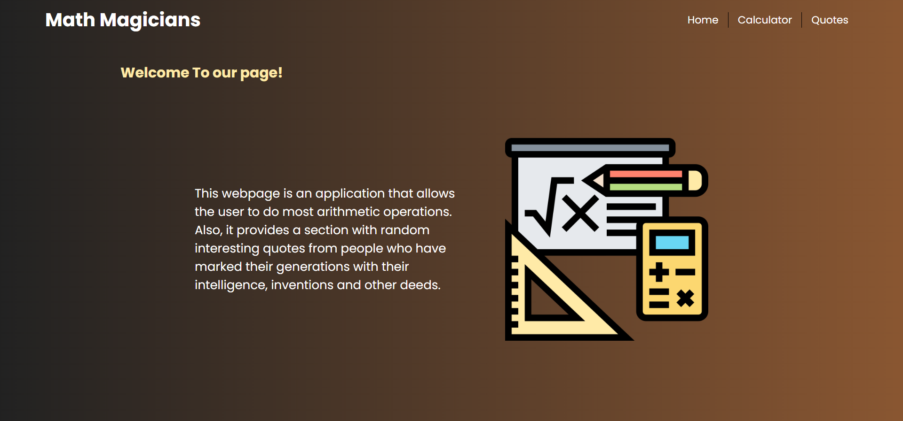

# Math Magicians

> "Math magicians" is a website for all fans of mathematics. It is a Single Page App (SPA) that allows users to:
>
> - Make simple calculations.
> - Read a random math-related quote.

## Built With

- HTML, CSS and JavaScript.
- React.js.
- Node.js (npm).
- Jest(for testing).

## Live Demo (if available)

[**See Project 🚀**](https://math-magician2.netlify.app/)

## Screenshot

### Desktop



## Getting Started

To get a local copy up and running follow these simple example steps.

### Prerequisites

To understand the project you must have a basic knowledge of HTML, CSS and Javascript and most importantly React.js.

### Setup

To run this project one must have Visual Studio (VS) Code installed and running.

### Usage

Clone and access the repository using the following commands on Git Bash:

```
 cd PATH
 git clone https://github.com/DaveZag/math-magician.git
 cd math-magician
```

Open the directory in visual studio code by typing the following command in Git Bash:

```
code .
```

To install all the dependencies and start the program, use the following commands:

```
npm install
npm start
```

## Repo Links

- Repository: [Math magician](https://github.com/DaveZag/math-magician)

## Author

👤 **Dave ZAGABE**

### Socials :

- GitHub: [@Dave Zag](https://github.com/DaveZag)
- Twitter: [@Dave Zagabe](https://twitter.com/davezagabe2)
- LinkedIn: [@Dave Zagabe](https://www.linkedin.com/in/dave-zagabe)

## 🤝 Contributing

Contributions, issues, and feature requests are welcome!

Feel free to check the [issues page](../../issues/).

## Show your support

Give a ⭐️ if you like this project!

## Acknowledgments

- Microverse for the template and project structure.

## 📝 License

This project is [MIT](./LICENSE) licensed.
